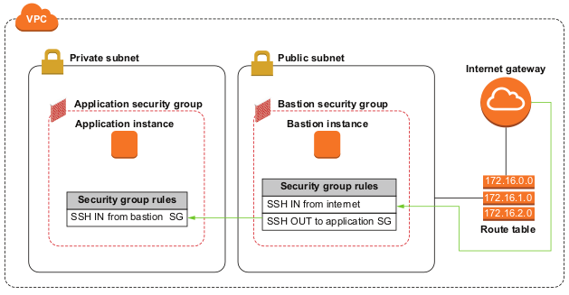

# Bastion Host

**SSH access to private application through the bastion host**


### Create the CloudFormation Stack
* Clone this repo
```bash
git clone https://github.com/cloudsolutionist/bastion-host.git
```
```bash
cd bastion-host
```

* Create S3 bucket
```bash
export BUCKET_NAME=<unique-name-or-random-string>
```
```bash
aws s3 mb s3://$BUCKET_NAME
```

* Upload the CloudFormation template to S3
```bash
aws s3 cp template.cf.json s3://$BUCKET_NAME
```

* Create the CloudFormation Stack
```bash
export STACK_NAME=BastionHostExample
```
```bash
aws cloudformation create-stack --stack-name $STACK_NAME --template-url https://$BUCKET_NAME.s3.amazonaws.com/template.cf.json
```

* Check status and keep checking until the value is `CREATE_COMPLETE`
```bash
aws cloudformation describe-stacks --stack-name $STACK_NAME --query Stacks[].StackStatus --output text
```

Now that the stack status is complete, it's time to ssh into our internal application instance via the bastion host.

### SSH to Bastion Instance (`BastionInstance`)

* Get the ID of the `MyKeyPair` Key Pair

```bash
KEY_PAIR_ID=$(aws ec2 describe-key-pairs --filters Name=key-name,Values=MyKeyPair --query KeyPairs[*].KeyPairId --output text)
```
* Get the parameter of your key and save the key material in a `.pem` file.
```bash
aws ssm get-parameter --name /ec2/keypair/$KEY_PAIR_ID --with-decryption --query Parameter.Value --output text > MyKeyPair.pem
```

* Run this command, if necessary, to ensure your key is not publicly viewable
```bash
chmod 400 MyKeyPair.pem
```

* Get the Public DNS of the `BastionInstance`
```
PUBLIC_IP=$(aws ec2 describe-instances --filters "Name=tag-key,Values=Name" "Name=tag-value,Values=BastionInstance" --query Reservations[].Instances[0].PublicDnsName --output text)
```

* Now SSH to the instance
```bash
ssh -i "MyKeyPair.pem" ec2-user@$PUBLIC_IP
```

### SSH to instance running in private network through bastion instance

* Exit from `BastionInstance`

```bash
exit
```

* Get the PrivateIP of the internal `ApplicationInstance`
```
aws ec2 describe-instances --filters "Name=tag-key,Values=Name" "Name=tag-value,Values=ApplicationInstance" --query Reservations[].Instances[0].PrivateIpAddress --output text > private-ip.txt
```

* Transfer the files `MyKeyPair.pem` and `private-ip.txt` from your host to the bastion instance
```bash
scp -i "MyKeyPair.pem" MyKeyPair.pem ec2-user@<public-ip-address>:
```
```bash
scp -i "MyKeyPair.pem" private-ip.txt ec2-user@<public-ip-address>:
```

* SSH to bastion instance again
```bash
ssh -i "MyKeyPair.pem" ec2-user@$PUBLIC_IP
```

* SSH to private instance (`InternalApplicationInstance`)
```bash
PRIVATE_IP=$(cat private-ip.txt)
```
```bash
ssh -i "MyKeyPair.pem" ec2-user@$PRIVATE_IP
```

### Clean up resources

* Exit from internal instance (`ApplicationInstance`)
```bash
exit
```

* Exit from bastion host (`BastionInstance`)
```bash
exit
```

* Empty and Delete the S3 Bucket
```bash
aws s3 rm s3://$BUCKET_NAME --recursive
```
```bash
aws s3 rb s3://$BUCKET_NAME 
```

* Delete the cloudformation stack
```bash
aws cloudformation delete-stack --stack-name $STACK_NAME
```

